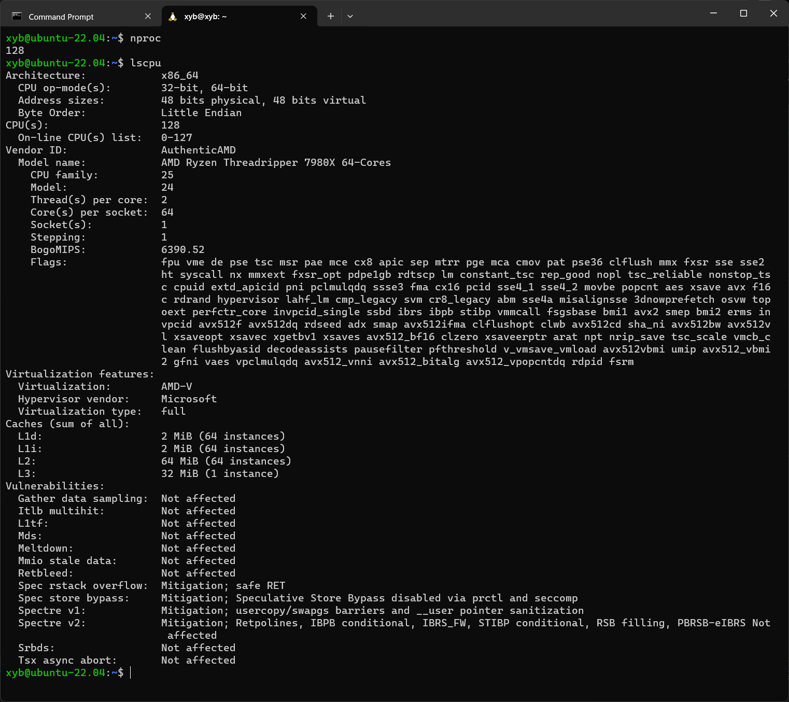

## Support more than 64 cores

If you want to use more than 64 cores in WSL2 (e.g. if you have AMD Threadripper 7980x), you can follow the steps:

1. Generate project

        mkdir build
        cd build
        cmake ..

1. Open `build/Project.sln` and generate a x64 release build.

1. Launch task manager, kill `wslservice.exe` process.

1. Copy the generated `build/Release/computecore.dll` to `C:\Program Files\WSL\`.

1. Launch any WSL2 distribution, type `nproc` or `lscpu`, you should see all cores.

    